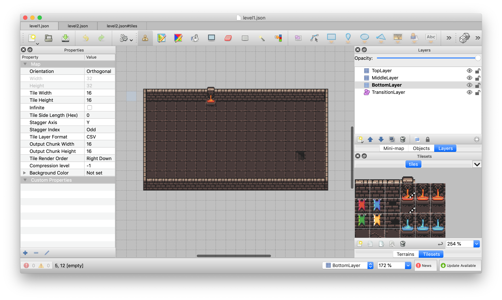
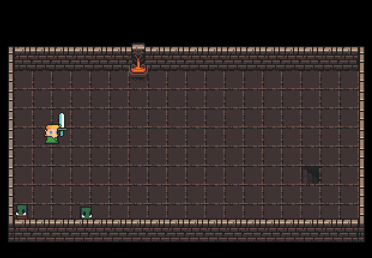
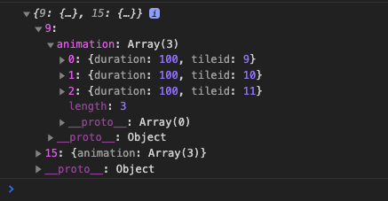
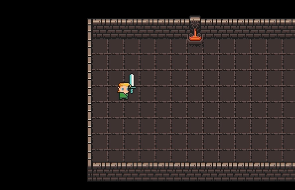

# Tiled Generated Map with Phaser 3

In this tutorial, you will learn how to import the tile map from [Tiled](https://www.mapeditor.org/). This tutorial is based on [this amazing tutorial](https://medium.com/@michaelwesthadley/modular-game-worlds-in-phaser-3-tilemaps-1-958fc7e6bbd6) made by [Michael Hadley](https://medium.com/@michaelwesthadley).

## Creating a Map with Tiled



By the end of this section, you should have something like above picture.

Let's start by creating a simple map in Tiled. To learn how to use Tiled, you can check out [this tutorial](https://www.youtube.com/watch?v=ZwaomOYGuYo). You can download the asset I'm using [here](https://github.com/ioneone/shining-soul-j/blob/develop/public/assets/map/tiles.png). This tileset consists of tiles with size 16x16 pixels. 

First, Create a map with size 32x32 tiles. To import the tileset, go to the panel on the bottom right corner and clock `New Tileset`.

Now go to the panel on the top right corner and create these 4 layers (the order matters!):
- TopLayer (TileLayer)
- MiddleLayer (TileLayer)
- BottomLayer (TileLayer)
- TransitionLayer (ObjectLayer)

What is a layer? Well, a tile map can consist of multiple layers and they are rendered in the order from bottom to top. This is useful when you want to place a tile on top of another tile. You won't be able to do this if you only have one layer.

`TopLayer`: Any tile in this layer appears on the top. Game objects can't interact with this layer (More on this in later tutorial).

`MiddleLayer`: Game objects can interact with this layer. Place any tile the game objects can collide with in this layer.

`BottomLayer`: Same as `MiddleLayer` except this layer is rendered first.

`TransitionLayer`: This is different from all the layers above. Place any invisible object you want to detect the collision/overlap with the game objects. For example, you can place a rectangle such that when the player overlaps with it, it loads a new map.

Now, fill out the layer with the tiles and try to make is look like the picture above. Note the lava tile is animated. You can check [this tutorial](https://youtu.be/ZwaomOYGuYo?t=921) to find out how to animate a tile. Also don't forget to go to the bottom right corner and click `Edit Tileset`, in which you can set custom property for the tiles. Add `collision: true` for the wall tiles. When we export the map later, this information will also be stored in the file. Finally, remember to add a transition object on the stairs.

Once you are done with creating the map, export it as JSON file by clicking `File > Save As`.

## Importing Tilemap in Phaser 3

Phaser 3 has built-in support for parsing Tiled map data. We just need to tell APIs how our tile map is structured (top layer, middle layer, ... etc). 

Define `TileLayer` enum as follows. Note the name of the layers must match how you named them in Tiled.

```typescript
export enum TileLayer
{
  Top = "TopLayer",
  Middle = "MiddleLayer",
  Bottom = "BottomLayer",
  Transition = "TransitionLayer"
}
```

Also, the transition objects in Tiled are converted to a JSON object as follows:

```typescript
export interface TiledTransitionObject
{
  id: number;
  x: number;
  y: number;
  width: number;
  height: number;
  name: string;
  properties: Array<{
    name: string,
    type: string,
    value: string | number
  }>;
}
```

Custom properties you defined in Tiles will be stored in `properties`. You can open your JSON tile map file to confirm this.

We will create a phaser scene `TilemapScene` that is responsible for drawing the tilemap. Later you can create another scene class that extends `TilemapScene` to add player and enemies. 

```typescript
class TilemapScene extends Phaser.Scene
{

  constructor()
  {
    super("TilemapScene");
  }

  public init(data: any): void
  {
  }

  public preload(): void
  {
  }

  public create(data: any): void
  {
  }
  
  public update(time: number, delta: number): void
  {
  }

}
```

The first thing we should do is to preload the tile map JSON file and the tile set image file.

```typescript
public preload(): void
{
  const tilemapFilePath = "assets/map/map.json";
  const tilesetFilePath = "assets/map/tiles.png";
  this.load.image(tilesetFilePath, tilesetFilePath);
  this.load.tilemapTiledJSON(tilesetFilePath, tilesetFilePath);
}
```

The first argument is an id for the resource and the second argument is the file path for the resource. Since the file path is already unique, we can just use it for the key.

Once the resources are loaded, we need to parse them into Phaser's tile objects.

```typescript
public create(data: SceneTransitionData): void
{
  this.tilemap = this.make.tilemap({ key: "assets/map/map.json" });
  this.tileset = this.tilemap.addTilesetImage("tiles", "assets/map/tiles.png");
}
```

The second argument of `addTilesetImage()` must match the key you specified in the `preload()` function. The first argument is how you named the tile in Tiled. By default, Tiles uses the file name (excluding the extension) to name your tile set (e.g. `path/to/file/foo.png` => `foo`).

In Tiled, we created layers as follows:
- TopLayer
- MiddleLayer
- BottomLayer
- TransitionLayer

`TopLayers` draws on top of `MiddleLayer`, `MiddleLayer` draws on top of `BottomLayer`, and so on. So we need to instantiate the layers bottom up.

```typescript
// create transition layer
...

// create bottom layer
...

// create middle layer
...   

// create top layer
...
```

Let's start with transition layer.

```typescript
const transitionObjectGroup = this.physics.add.staticGroup();
const tiledTransitionObjects = 
  this.tilemap.getObjectLayer(TileLayer.Transition).objects 
    as TiledTransitionObject[];
tiledTransitionObjects.forEach(tiledTransitionObject => {
  // transitionObjectGroup?.add(
  //   new SceneTransitionObject(this, tiledTransitionObject)
  // );
});
```

You can use `transitionObjectGroup` to check the overlap between player and transition objects using `this.physics.add.overlap(player, transitionObjectGroup)`. `SceneTransitionObject` is just a custom class for parsing `tiledTransitionObject.properties`. Don't worry about this for now. I will publish tutorial about this later.

The other layers are pretty straightforward.

```typescript
// create bottom layer
const bottomLayer = this.tilemap.createDynamicLayer(
  TileLayer.Bottom, this.tileset, 0, 0);
bottomLayer.setCollisionByProperty({ collision: true });   

// create middle layer
const middleLayer = this.tilemap.createDynamicLayer(
  TileLayer.Middle, this.tileset, 0, 0);
middleLayer.setCollisionByProperty({ collision: true });     

// create top layer
const topLayer = this.tilemap.createDynamicLayer(
  TileLayer.Top, this.tileset, 0, 0);
```

Note the key `collision` in `setCollisionByProperty({ collision: true })` must match how you named your custom tile property in Tiled. `setCollisionByProperty({ collision: true })` registers the tiles with `collision: true` as collidable objects. You can do something like `this.physics.add.collider(player, middleLayer)` to prevent the player from passing through the walls.

Finally, listen for cursor key inputs so you can navigate the scene and check whether everything is working.

```typescript
public update(time: number, delta: number)
{
  // configure camera
  this.cameras.main.setBounds(
    0, 0, tilemap.widthInPixels, tilemap.heightInPixels);
  this.cameras.main.setZoom(2);

  const cursors = this.input.keyboard.createCursorKeys();
  if (cursors.up.isDown)
  {
    this.cameras.main.scrollY += 4;
  }
  else if (cursors.down.isDown)
  {
    this.cameras.main.scrollY -= 4;
  }

  if (cursors.left.isDown)
  {
    this.cameras.main.scrollX += 4;
  }
  else if (cursors.right.isDown)
  {
    this.cameras.main.scrollX -= 4;
  }
}
```

Hopefully you see something like this (ignore the game objects like player):



You probably have noticed that lava tile is not animating! Unfortunately, Phaser 3 doesn't support tile animation, so you have to implement it yourself. The good news is, somebody already did it. You can find the plugin [here](https://github.com/nkholski/phaser-animated-tiles). Or you can implement it yourself, which is what we will do. If you look at `tileset.tileData`, it has something like this:



The key is the tile id and the value has animation data for that tile. Define `TilesetTileData` and `TileAnimationData` as follows:

```typescript
type TilesetTileData = 
  {[key: number]: { animation?: TileAnimationData }};

type TileAnimationData = 
  Array<{ duration: number, tileid: number }>;
```

So after creating the top layer, find which tiles should be animated. Then create a wrapper class `AnimatedTile` (which we will define later) to take care of the animation.

```typescript
const animatedTiles = []

for (let key in tileset.tileData as TilesetTileData)
{
  tilemap.layers.forEach(layer => {
    if (layer.tilemapLayer.type === "DynamicTilemapLayer") 
    {
      layer.data.forEach(tileRow => {
        tileRow.forEach(tile => {
          if ((tile.index - tileset.firstgid) === parseInt(key)) 
          {
            animatedTiles.push(
              new AnimatedTile(
                tile,
                (tileset.tileData as TilesetTileData)[key].animation,
                tileset.firstgid
              )
            );
          }
        });
      });
    }
  })
}
```

Note `firstgid` is the id of the first tile in the tile set. Typically `firstgid` is `1`, but the tile id in Tiled starts with `0`.

Then every frame, we update the animated tile if necessary.

```typescript
public update(time: number, delta: number): void
{
  animatedTiles.forEach(tile => tile.update(delta));
}
```

`delta` is elapsed time in ms from last frame, which is automatically passed by Phaser.

Now create `AnimatedTile` class as follows:

```typescript
/**
 * Tile with animation.
 * @class
 * @classdesc
 * As of Phaser 3.23.0, animted tile is not supported. This is a simple implementation 
 * of animating {@link Phaser.Tilemaps.Tile} and probably does not cover all 
 * the edge cases. Assume the duration of animation is uniform for simplicity.
 */
class AnimatedTile
{
  // reference to the tilemap tile to animate
  private tile: Phaser.Tilemaps.Tile;

  // the data needed for animating the tile
  private tileAnimationData: TileAnimationData;

  // the starting index of the first tile index the tileset of the tile contains
  private firstgid: number; 

  // the elapsed time that loops between 0 and max animation duration
  private elapsedTime: number;

  // the length of animation in ms
  private animationDuration: number;

  /**
   * @param {Phaser.Tilemaps.Tile} tile - the tile to animate
   * @param {TileAnimationData} tileAnimationData  - the animation data
   * @param {number} firstgid - the starting index of the first tile index the tileset of the tile contains
   */
  constructor(tile: Phaser.Tilemaps.Tile, tileAnimationData: TileAnimationData, firstgid: number)
  {
    this.tile = tile;
    this.tileAnimationData = tileAnimationData;
    this.firstgid = firstgid;
    this.elapsedTime = 0;
    // assuming the duration is uniform across all frames
    this.animationDuration = tileAnimationData[0].duration * tileAnimationData.length;
  }

  /**
   * Update the tile if necessary. This method should be called every frame.
   * @param {number} delta - the delta time in ms since the last frame
   */
  public update(delta: number): void
  {
    this.elapsedTime += delta;
    this.elapsedTime %= this.animationDuration;

    const animatonFrameIndex = Math.floor(this.elapsedTime / this.tileAnimationData[0].duration);

    this.tile.index = this.tileAnimationData[animatonFrameIndex].tileid + this.firstgid;
  }
}
```

I've added comments so it should be clear to understand what is going on. One thing to note though, is that I assumed the duration of every tile frame is the same, which is not true all the time. But this is enough for now. We will relax this restriction when we need to.

Now refresh the page and you will see the animating lava.

