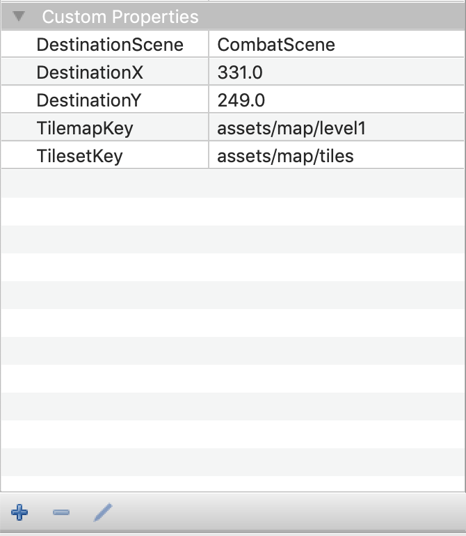

# Scene Transition with Phaser 3

This is continuation of [Tiled Generated Map with Phaser 3](https://github.com/ioneone/shining-soul-j/blob/develop/logs/3-Tiled-Generated-Map-with-Phaser-3.md). In this tutorial, we will see how to implement scene transition.

The transition objects in Tiled are converted to a JSON object as follows:
```typescript
export interface TiledTransitionObject
{
  id: number;
  x: number;
  y: number;
  width: number;
  height: number;
  name: string;
  properties: Array<{
    name: string,
    type: string,
    value: string | number
  }>;
}
```

`properties` are where the all the user defined properties are stored. In your 
`TilemapScene`'s `create()` method, add these code below.

```typescript
const transitionObjectGroup = this.physics.add.staticGroup();
const tiledTransitionObjects = 
  this.tilemap.getObjectLayer(TileLayer.Transition).objects as TiledTransitionObject[];
tiledTransitionObjects.forEach(tiledTransitionObject => {
  transitionObjectGroup?.add(new SceneTransitionObject(this, tiledTransitionObject));
});
```

`SceneTransitionObject` is just a custom class for parsing `tiledTransitionObject.properties`. We will talk more about this later.

Suppose we have a player sprite. To detect the overlaps between the player and the transition objects, we can use the `scene.pyhsics.add.overlap()` method.

```typescript
this.physics.add.overlap(this.player, this.transitionObjectGroup,
  (object1, object2) => {
    const player = object1 as Player;
    player.getBody().setEnable(false);
    const sceneTranstionData = 
      (object2 as SceneTransitionObject).getSceneTransitionData();
    this.scene.start(sceneTranstionData.destinationScene, 
      sceneTranstionData);
  });
```

`TilemapScene` needs to know `tilemapKey` and `tilesetKey` to create the world. So in Tiled's transition object's custom properties, we need to pass these information.



Disable the physics body of the player after first overlap. Otherwise it will continuously fire the overlap callback. Use `scene.start()` to transition from one scene to another. The first argument is the key of the scene you want to transition to. The second arguemnt is the data you want to send to this scene for initialization.

Then in your destination scene's `init()` method, you can read those data.

```typescript
public init(data: SceneTransitionData): void
{
  super.init(data);
  this.animatedTiles = [];
  this.tilemapKey = data.tilemapKey;
  this.tilesetKey = data.tilesetKey;
}
```

Finally, you just need to create `SceneTransitionObject` class that parses the custom properties from Tiled.

```typescript
/**
 * Custom properties of scene transition obejct. This is the data that will be 
 * passed for {@link TilemapScene} `init()` and `create()` methods.
 * @interface
 */
export interface SceneTransitionData
{
  // the id of the scene to transition into
  destinationScene?: string;
  // the x coordinate in tiles to spawn the player in the next scene
  destinationX?: number;
  // the y coordinate in tiles to spawn the player in the next scene
  destinationY?: number;
  // the key of the tilemap to load
  tilemapKey?: string;
  // the key of the tileset to load
  tilesetKey?: string;
}

/**
 * A Phaser representation of transition object from Tiled map.
 * @class
 * @classdesc
 * This will be used for overlap detection with the player. When the player 
 * overlaps with this object, you should trigger the scene transition.
 */
class SceneTransitionObject extends Phaser.GameObjects.Rectangle
{

  private sceneTransitionData: SceneTransitionData;

  /**
   * @param {Phaser.Scene} scene - The scene this object belongs to
   * @param {TiledTransitionObject} tiledTransitionObject - The raw transition object from Tiled program
   */
  constructor(scene: Phaser.Scene, tiledTransitionObject: TiledTransitionObject)
  {
    super(scene, tiledTransitionObject.x, tiledTransitionObject.y);

    this.sceneTransitionData = {};

    // Tiled uses top left corner as the origin
    this.setOrigin(0);
    this.setSize(tiledTransitionObject.width, tiledTransitionObject.height);

    // Parse Tiled transition object.
    // Make sure the names match the properties in Tiled.
    const tiledTransitionObjectPropertiesDictionary = this.convertTiledTransitionObjectPropertiesToDictionary(tiledTransitionObject.properties);
    this.sceneTransitionData.destinationScene = tiledTransitionObjectPropertiesDictionary["DestinationScene"] as string;
    this.sceneTransitionData.destinationX = tiledTransitionObjectPropertiesDictionary["DestinationX"] as number;
    this.sceneTransitionData.destinationY = tiledTransitionObjectPropertiesDictionary["DestinationY"] as number;
    this.sceneTransitionData.tilemapKey = tiledTransitionObjectPropertiesDictionary["TilemapKey"] as string;
    this.sceneTransitionData.tilesetKey = tiledTransitionObjectPropertiesDictionary["TilesetKey"] as string;
  }

  /**
   * Get the data needed for starting next scene. This is the data to pass 
   * for a scene's initialization.
   * @return {SceneTransitionData} - the data representation of this object
   */
  public getSceneTransitionData(): SceneTransitionData
  {
    return this.sceneTransitionData;
  }

  private convertTiledTransitionObjectPropertiesToDictionary(properties: Array<{
    name: string,
    type: string,
    value: string | number
  }>): {[key: string]: (string | number)}
  {
    let dictionary = {};
    properties.forEach(property => {
      dictionary[property.name] = property.value;
    });
    return dictionary;
  }
  
}
```